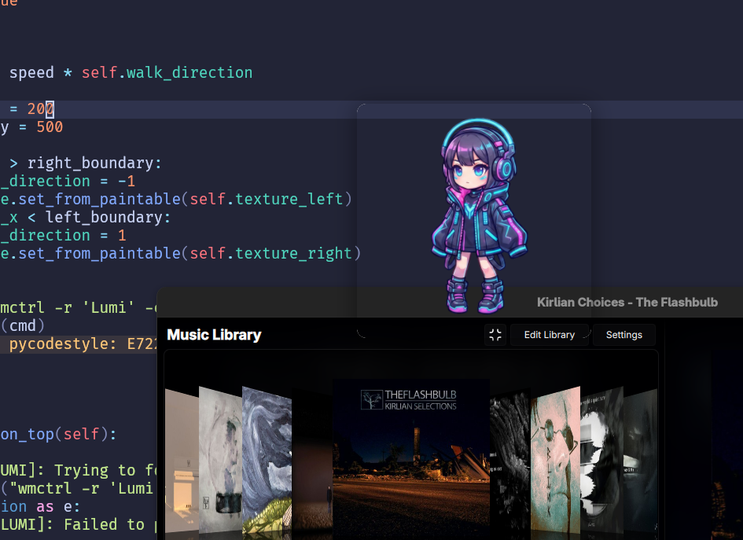

# Lumi
### Basic GTK4 Desktop Pet

My first Linux specific program, made for personal use, and entertainment.



### Requirements

This program forces the legacy x11

You need to install **wmctrl**, and **xdotool** for your distribution in order to run Lumi

In Fedora's case, use:

```bash
  sudo dnf install wmctrl
```

```bash
  sudo dnf install xdotool
```

## Disclaimer

The assets were made with Google Gemini, and are temporary. Do not use them for "real" projects.
