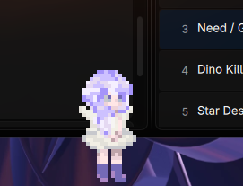

# Lumi
## Desktop Pet
### Rewritten in C++

**Lumi** is my first desktop pet, originally written for GTK4 in Python.

A classmates work with custom Shimeji pets inspired me to continue this project, and make it better (or usable in the first case).

I'm using **C++** and **Qt** this time for a safer approach, that is also cross-platform.
The project still relies on **X11** under Linux.

The project has been only tested on Linux (Fedora Workstation) so far.

Her updated design as of *2026/03/15*:



### Building

* Install developer tools for **C++ 20** on your OS
* Install **Qt** and an IDE (or any other development environment) capable of building with **CMake**
* Add a new *CMakeLists.txt* to the project files
* Replace the system specific variable responsible for finding Qt
* Build with CMake 4.1 or newer

#### CMakeLists.txt

```cmake
cmake_minimum_required(VERSION 4.1)
project(lumi)

set(CMAKE_CXX_STANDARD 20)
set(CMAKE_AUTOMOC ON)
set(CMAKE_AUTORCC ON)
set(CMAKE_AUTOUIC ON)

set(CMAKE_PREFIX_PATH "/../path/to/Qt/6.10.2/gcc_64")

find_package(Qt6 COMPONENTS
        Core
        Gui
        Widgets
        REQUIRED)

add_executable(lumi main.cpp
        core/Lumi.cpp
        core/Lumi.h
        core/Globals.h)
target_link_libraries(lumi
        Qt::Core
        Qt::Gui
        Qt::Widgets
)
```